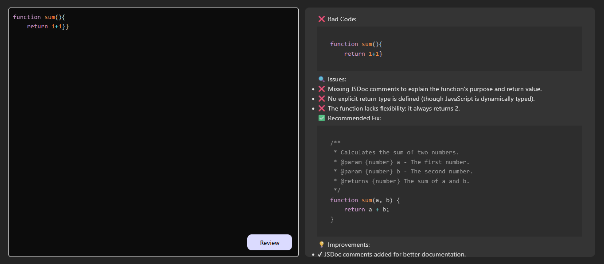

# 🚀 Code Reviewer

[](https://flutter.dev/)
[](https://nodejs.org/)
[](LICENSE)

**Code Reviewer** is a modern Flutter Website that allows developers to **submit, review, and manage code snippets** efficiently. Powered by a **Node.js backend**, it ensures seamless data handling and real-time feedback.

## ✨ Features

- Submit and manage code snippets with ease  
- Automatic code analysis and suggestions  
- Real-time updates and feedback  
- User authentication and session management  
- Modern, responsive Flutter UI for smooth experience  

---

## 🛠️ Tech Stack

| Frontend | Backend | Database | Other Tools |
|----------|---------|----------|-------------|
| Flutter (Dart) | Node.js (Express) | PostgreSQL / Firebase | GitHub API integration, AI-assisted code suggestions |


## 📦 Installation

### 1. Clone the Repository
```bash
git clone https://github.com/FlutterSanjay/Code_Reviewer.git
cd Code_Reviewer


```
## WEB-VIEW

